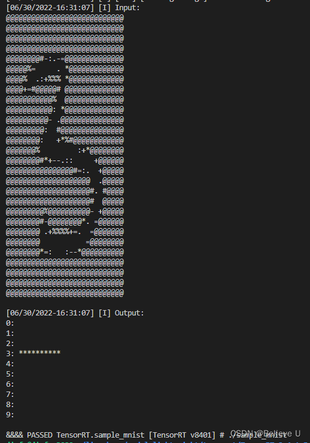
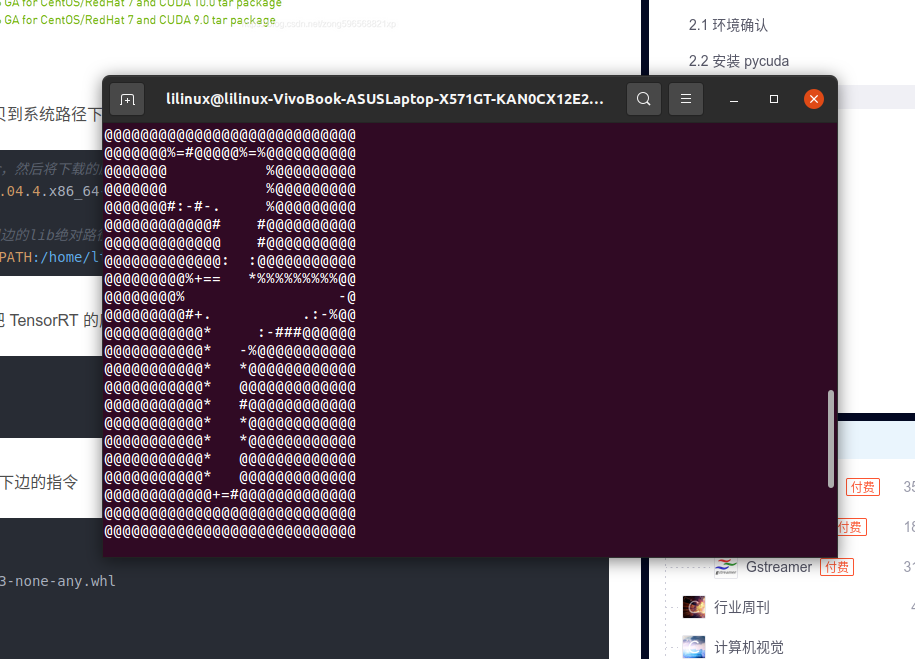
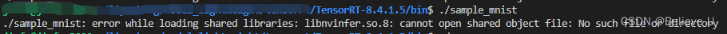
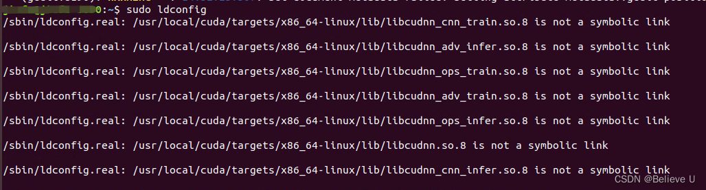
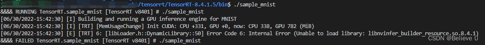

# Yolov7_Tensorrt_ROS

This project provides a detailed tutorial for how to use yolov7 in ROS based on the acceleration of tensorrt. 

Please find the Chinese user guide ./yolov7_tensorrt_ros/使用教程.pdf.

The English user guide as follows:

# Acknowledge

yolov7 https://github.com/WongKinYiu/yolov7

YOLOv7_Tensorrt https://github.com/Monday-Leo/YOLOv7_Tensorrt

# Installment of Tensorrt

```
cd yolov7_tensorrt_ros
```

Create the conda environment
```
conda create -n name python=3.9
pip install -r requirements.txt
```
Use the following instructions to make sure that you have correctly install CUDA and CUDNN
```
NVCC -V
cat /user/local/cuda/include/cudnn_version.h | grep CUDNN_MAJOR -A 2 
```
Download the tensorrt
Click into https://developer.nvidia.com/nvidia-tensorrt-8x-download

Find the suitable version, download it and install it.

```
tar -xzvf TensorRT-8.4.1.5.Linux.x86_64-gnu.cuda-11.6.cudnn8.4.tar.gz
vim ~/.bashrc
put the following sentence at the bottom of the ./bashrc
# export LD_LIBRARY_PATH=$LD_LIBRARY_PATH：../TensorRT-8.4.1.5/lib
source ~/.bashrc
```
Run the samples to make sure that you have install the tensorrt successfully.
```
cd ../TensorRT-8.4.1.5/samples/sampleMNIST
make -j16
cd ../../bin/
./sample_mnist
```
If you find the results like



or



That means you have successfully install the tensorrt

# Problem during installing
## Problem1

```
sudo gedit /etc/ld.so.conf
../TensorRT-8.4.1.5/lib
sudo ldconfig
```

## Problem2

```
sudo ldconfig -v
sudo ln -sf /usr/local/cuda/targets/x86_64-linux/lib/libcudnn.so.8.4.0
/usr/local/cuda/targets/x86_64-linux/lib/libcudnn.so.8
```
## Problem3

```
sudo cp ../TensorRT-8.4.1.5/lib/libnvinfer_builder_resource.so.8.4.1
/usr/lib
```
# Download the packages
```
git clone https://github.com/WongKinYiu/yolov7
git clone https://github.com/Monday-Leo/YOLOv7_Tensorrt
```
Add YOLOv7_ EfficientNMS.py and export of Tensorrt warehouse_ Copy onnx. py to yolov7 and export it with Efficient NMS ONNX model (remember to install the conda environment before opening it.

```
python export_onnx.py --weights ./weights/yolov7.pt
```
If you don't have the pre-trained model of yolo, download at https://github.com/WongKinYiu/yolov7/releases/download/v0.1/yolov7.pt
and put it into ./weights


